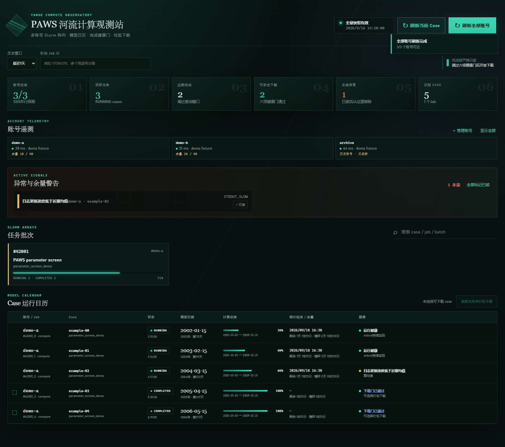
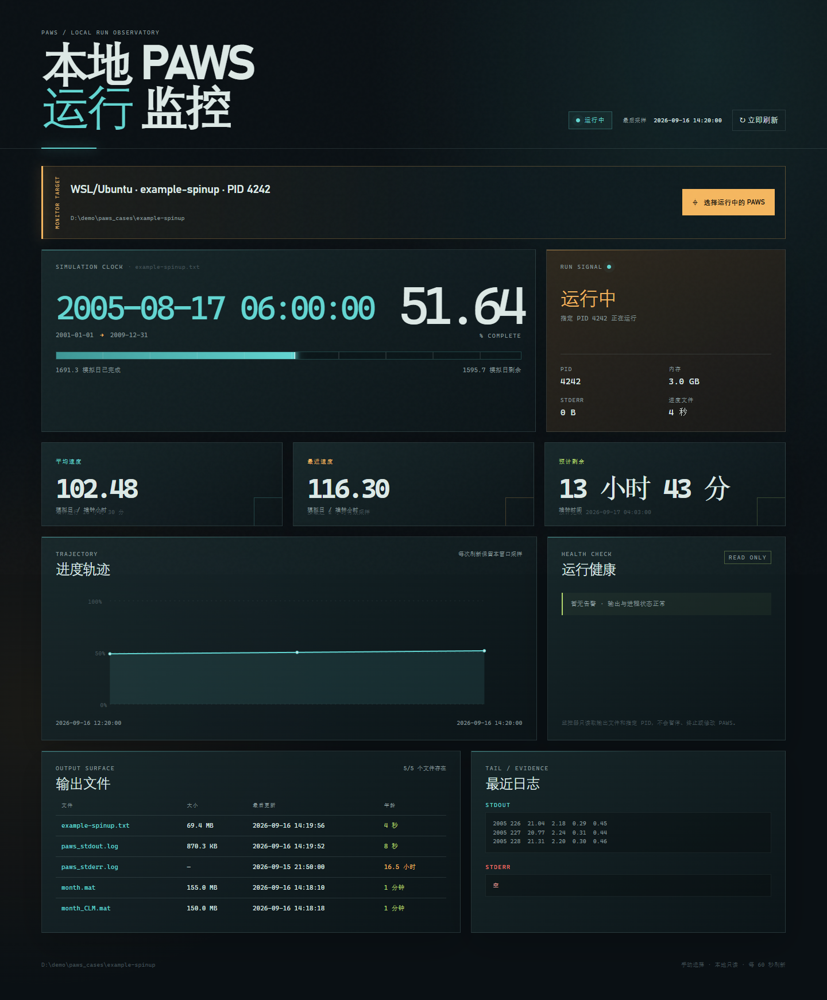
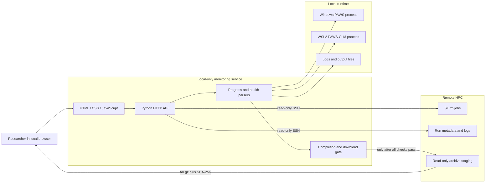

# PAWS Monitoring Suite

统一监控本地 Windows/WSL2 与远程 Slurm/HPC 上的 PAWS/PAWS-CLM 长时间任务，提供进度、速度、ETA、异常检测，以及完成后的校验下载。

**实际使用规模：** 已用于 300+ PAWS Case 的运行管理，支持同时查看数十个 Slurm 任务。  
**Tech Stack：** Python · OpenSSH · Slurm · Windows/WSL2 · HTML/CSS/JavaScript · Playwright · unittest

## Highlights

- **统一监控两类运行环境**：远程 Slurm/HPC 与本地 Windows/WSL2 使用同一套进度和健康状态逻辑。
- **任务状态与 ETA**：解析模型日志和运行状态，展示进度、平均/近期速度、预计完成时间与日志停滞情况。
- **异常识别**：结合 stderr、返回码、日志新鲜度和核心输出判断任务是否真正完成。
- **多账号 HPC 聚合**：通过只读 SSH 并发查询多个 Slurm 账号，减少逐账号登录和人工检查。
- **结果安全下载**：任务通过完成健康门后再打包下载，并生成 SHA-256 与 manifest 进行完整性校验。
- **默认只读**：监控流程不终止、不暂停、不改优先级，也不重提任务。

## Demo

### Remote HPC Dashboard



### Local Windows / WSL2 Monitor



## Why I Built It

PAWS 单次试验可能持续数小时到数天。我在实际科研中需要同时管理本机 WSL2 与远程 HPC 上的大量 Case。随着任务数量增加，反复执行 `squeue`、`tail`、任务管理器和手工 `scp` 逐渐成为明显的时间成本，也容易因为账号、case 和输出前缀混淆而误判任务状态。

因此我把自己的运行检查流程做成了两个轻量 Web 组件，并统一为“进度、速度、ETA、健康状态和下载证据”的监控模型。

## Components

| Component | Purpose | Key Capabilities |
| --- | --- | --- |
| HPC Dashboard | 多账号 Slurm 任务监控与结果下载 | 并发只读 SSH、任务聚合、异常告警、完成健康门、打包下载、哈希校验 |
| Local Monitor | Windows / WSL2 本地进程监控 | 目标选择、PID 身份校验、日志尾读、进度解析、速度与 ETA、输出文件新鲜度 |

## Architecture



## Tech Stack

| Layer | Technology |
| --- | --- |
| Backend | Python standard-library HTTP server, concurrent tasks, subprocess |
| Frontend | HTML, CSS, JavaScript |
| Remote Compute | OpenSSH, Slurm, read-only shell queries |
| Local Runtime | Windows Process API, WSL2, `/proc` |
| Testing | `unittest`, Playwright UI smoke tests |
| Desktop Entry | PowerShell, background Python launcher, Windows shortcut |

## Quick Start

Requirements: Windows 10/11 and Python 3.9+. HPC monitoring also requires OpenSSH. WSL2 is required for local Linux process monitoring.

```powershell
cd paws-monitoring-suite
conda env create -f environment.yml
conda activate paws-monitor
Copy-Item config.example.json config.local.json
```

Start the HPC dashboard:

```powershell
python hpc_dashboard/app.py --config config.local.json
```

Start the local monitor:

```powershell
python local_monitor/server.py
```

The example configuration contains only field definitions and demo values. Real hosts, usernames, private-key directories, download paths and account records should only be stored in `config.local.json`, which must remain excluded by `.gitignore`.

## Safety Design

- Web services bind to `127.0.0.1` by default.
- Monitoring operations do not terminate, pause, reprioritize or resubmit jobs.
- SSH operations are limited to reading job states, logs and file lists.
- Private keys are never sent to the browser or committed to the repository.
- Download is enabled only after return code, stderr, model end time and core outputs pass the completion gate.
- Remote downloads use temporary read-only staging and produce SHA-256 plus a manifest.
- WSL targets are validated against command line, working directory and process identity to reduce wrong-case monitoring.

## Testing

```powershell
python -m unittest discover -s hpc_dashboard/tests -p "test_*.py" -v
python -m unittest discover -s local_monitor/tests -p "test_*.py" -v
```

Local verification on 2026-09-16:

- HPC Dashboard: **14 unit tests passed**
- Local Monitor: **19 unit tests passed**

A fully mock-based CI workflow and screenshot regression test are planned for the public version.

## What I Built

- Unified Slurm state, PAWS logs and case metadata into a consistent monitoring model.
- Implemented concurrent multi-account SSH queries, timeout retries and failure categorization.
- Designed the full `job -> case -> health gate -> download package` flow.
- Implemented standard-result, full-directory and per-file download modes.
- Added SHA-256, manifest generation and output-role recognition for verifiable downloads.
- Implemented Windows/WSL2 process discovery, PID identity validation and cross-filesystem path conversion.
- Implemented average/recent speed, ETA, log-stall detection and output-file freshness checks.
- Added unit tests, Playwright smoke tests and desktop launch entry points.

## Public Repository Boundary

This repository does **not** include PAWS/PAWS-CLM source code, model inputs, real simulation results, server addresses, SSH configuration, private keys, account records, tokens, cookies or private Tailscale information. Screenshots and test fixtures use synthetic data.

## Roadmap

- Replace any remaining environment-specific configuration with public examples.
- Add fully mock-based CI for the public repository.
- Add UI screenshot regression tests.
- Publish the repository from a clean Git history after removing all real configuration and internal paths.
